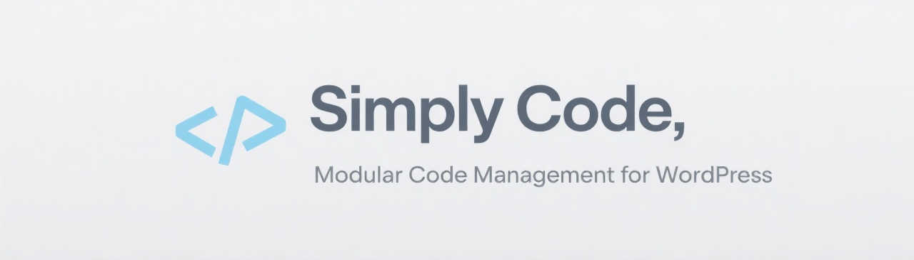

# Simply Code



Simply Code es un plugin de WordPress minimalista y eficiente que moderniza la forma de gestionar código personalizado en tu sitio. Diseñado como una alternativa modular y profesional a `functions.php`, permite administrar snippets de código como módulos independientes. A diferencia de otras soluciones, Simply Code utiliza un sistema de archivos directo en lugar de la base de datos, lo que resulta en mejor rendimiento y mayor portabilidad.

## ¿Por qué Simply Code?

- 📂 **Alternativa moderna a functions.php**: Organiza tu código en módulos independientes
- 🔄 **Activación/desactivación instantánea**: Prueba cambios sin modificar archivos del tema
- 🚀 **Sin dependencia de base de datos**: Mejor rendimiento y facilidad de migración
- 👥 **Ideal para equipos**: Facilita la colaboración y el control de versiones
- 🔒 **Modo seguro**: Validación de sintaxis antes de guardar y ejecutar código
- 🎨 **Soporte completo**: PHP, JavaScript y CSS en cada snippet

## Instalación

1. Descarga el archivo ZIP del plugin
2. Ve a tu panel de WordPress > Plugins > Añadir nuevo
3. Haz clic en "Subir Plugin" y selecciona el archivo ZIP
4. Activa el plugin

## Estructura de archivos

```
simply-code/  
├── admin/  
│   ├── class-admin-page.php  
│   ├── class-snippet-editor.php  
│   └── views/  
│       ├── snippet-editor.php  
│       └── snippets-list.php 
├── assets/  
│   ├── css/  
│   │   └── editor.css  
│   ├── js/  
│   │   └── editor.js  
│   └── images/  
│       └── banner.jpg  
├── includes/  
│   ├── class-snippet-manager.php  
│   ├── class-syntax-checker.php 
│   └── snippets-order.php
├── storage/  
│   ├── snippets/  
│   ├── js/  
│   ├── css/  
│   └── backups/  
├── templates/  
│   ├── class.php
│   ├── configuration.php
│   ├── function.php
│   └── hook.php
├── CHANGELOG.md  
├── CONTRIBUTING.md  
├── README.md  
├── readme.txt 
└── simply-code.php
```

## Uso

### Crear un nuevo snippet

1. Ve a "Simply Code" en el menú de WordPress
2. Haz clic en "Nuevo Snippet"
3. Completa los campos:
   - Nombre del snippet
   - Descripción
   - Código PHP, JavaScript y/o CSS
4. Guarda el snippet

### Ejemplos de snippets

```php
// Función personalizada
function mi_funcion_util() {
    // Tu código aquí
}

// Clase personalizada
class Mi_Clase_Personalizada {
    public function __construct() {
        // Inicialización
    }
}

// Hook de WordPress
add_action('init', function() {
    // Código a ejecutar
});

// Configuración personalizada
define('MI_CONSTANTE', 'valor');
```
```js
// JavaScript: Mostrar alerta en el frontend
document.addEventListener('DOMContentLoaded', function() {
    alert('¡Hola desde Simply Code!');
});
```
```css
/* CSS: Cambiar color de fondo del body */
body {
    background-color: #f5f5f5;
}
```

### Gestión de snippets

- **Activar/Desactivar**: Usa el interruptor en la lista de snippets
- **Ordenar**: Utiliza las flechas arriba/abajo para cambiar el orden de ejecución
- **Editar**: Modifica el código y configuración de cualquier snippet existente
- **Eliminar**: Elimina snippets que ya no necesites

## Ventajas del sistema basado en archivos

1. **Mejor rendimiento**: Sin consultas a la base de datos
2. **Mayor portabilidad**: Fácil de migrar entre instalaciones
3. **Control de versiones**: Los snippets pueden versionarse con Git
4. **Backups simplificados**: Copias de seguridad automáticas y fáciles de restaurar
5. **Depuración sencilla**: Los archivos son fáciles de inspeccionar y debuggear

## Modo seguro

El modo seguro realiza las siguientes validaciones:

- Comprueba la sintaxis PHP antes de guardar
- Valida la estructura del código
- Previene errores que podrían romper el sitio

## Características técnicas

- **Versión mínima de PHP**: 7.4
- **Versión mínima de WordPress**: 5.6
- **Licencia**: GPL v2 o posterior
- **Requiere privilegios**: `manage_options`

## Detalles técnicos recientes

- El plugin crea automáticamente las carpetas necesarias (`storage/snippets/`, `storage/js/`, `storage/css/`, `templates/`) si no existen, asegurando que el entorno esté listo desde la activación.
- El sistema de carga modular utiliza clases separadas para la gestión de snippets, validación de sintaxis y la interfaz de administración.
- Los hooks principales registrados son:
  - `after_setup_theme` para cargar los snippets al inicio.
  - `admin_menu` para registrar el menú de administración.
  - `wp_enqueue_scripts` para cargar los assets de los snippets en el frontend.
- El almacenamiento de los snippets y recursos asociados se realiza exclusivamente en el sistema de archivos, nunca en la base de datos.

Consulta el archivo CHANGELOG.md para un historial detallado de cambios y mejoras.

## FAQ

### ¿Por qué usar Simply Code en lugar de functions.php?

Simply Code ofrece una gestión modular del código, con interfaz gráfica profesional y la capacidad de activar/desactivar snippets individualmente. Además, mantiene tu código organizado y facilita la colaboración en equipo.

### ¿Cómo migro mis snippets a otra instalación?

Simplemente copia el contenido de la carpeta `storage/` y el archivo `includes/snippets-order.php` a la nueva instalación. Al estar basado en archivos, la migración es sencilla y directa.

### ¿Se pierden los snippets al actualizar el plugin?

No. Simply Code mantiene los snippets en una ubicación separada y crea backups automáticos antes de las actualizaciones.

### ¿Puedo usar Simply Code en un entorno multisite?

Sí, Simply Code es compatible con WordPress multisite. Cada sitio puede tener sus propios snippets independientes.

## Contribuir

Las contribuciones son bienvenidas. Por favor, revisa las [guías de contribución](CONTRIBUTING.md) antes de enviar un pull request.

## Soporte

- 📝 [Documentación](docs/README.md)
- 🐛 [Reportar un problema](../../issues)
- 💡 [Sugerir una característica](../../issues/new?template=feature_request.md)

## Licencia

Simply Code está licenciado bajo la GPL v2 o posterior. Consulta el archivo [LICENSE](LICENSE) para más detalles.

## Créditos

Desarrollado por David Camejo & AI
